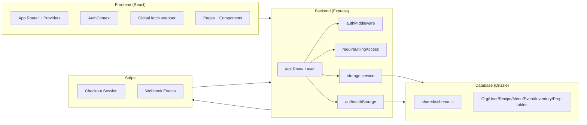
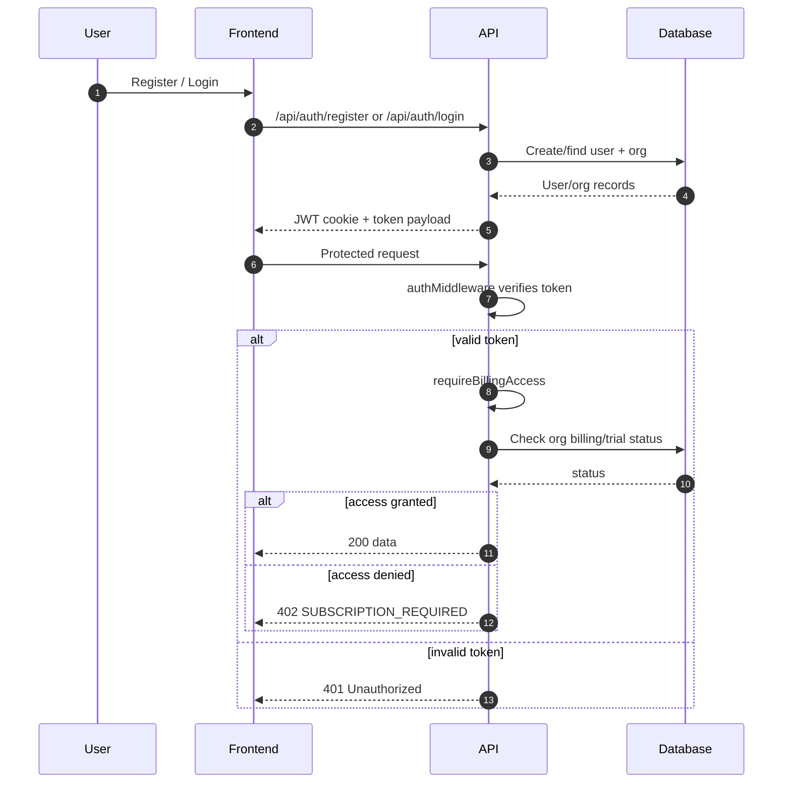
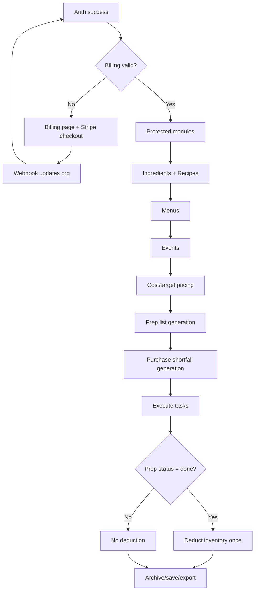

# CaterCalcPro Architecture (Internal)

## 1) Purpose

`caterCalcPro` (UI brand: **Gastro Grid**) is a multi-tenant catering operations platform that supports:

- recipe and ingredient cost management,
- menu composition,
- event planning and pricing,
- prep and purchase workflow generation,
- inventory tracking and stock deduction,
- subscription-gated access (Stripe-backed).

Core business loop:

1. Build recipes
2. Assemble menus
3. Plan events
4. Calculate cost/profit
5. Generate prep and purchase lists
6. Execute and update inventory
7. Reuse and optimize for next event

---

## 2) Tech Stack

### Frontend
- React + TypeScript + Vite
- React Router
- TanStack React Query
- Tailwind + shadcn/Radix components

### Backend
- Node.js + Express + TypeScript
- Route modules under `/api/*`
- Middleware: auth + billing access enforcement

### Data
- Drizzle ORM
- PostgreSQL/Neon in production
- PGlite fallback in local/dev

### Billing
- Stripe Checkout + Webhooks

---

## 3) High-Level Architecture

---

## 4) Domain Model Summary

Core entities:

- `organizations`: tenant + billing/subscription state
- `users`: org-scoped users with role
- `ingredients`: reusable ingredient definitions with cost/unit
- `recipes`: dish definitions
- `recipe_ingredients`: recipe lines
- `recipe_sub_recipes`: nested recipe composition
- `menus`: recipe collections
- `menu_recipes`: menu composition lines
- `events`: dated catering engagements
- `event_recipes`: recipe assignments per event
- `inventory`: stock and purchasing metadata
- `prep_lists` + `prep_list_items`: persisted operational workflows

All protected business data is scoped by `organizationId`.

---

## 5) Authentication and Authorization Flow

---

## 6) Subscription and Billing Flow

1. Frontend calls `POST /api/billing/create-checkout-session`.
2. Backend creates Stripe checkout session and returns URL.
3. User completes checkout in Stripe.
4. Stripe sends webhook events to `POST /api/billing/webhook`.
5. Backend updates organization subscription fields.
6. `requireBillingAccess` reflects updated access on next protected request.

---

## 7) Core Product Workflows

### 7.1 Recipe Workflow
- Create ingredients with units and cost-per-unit.
- Create recipe + ingredient lines.
- View recipe details with scaled quantities and cost-per-serving.
- Edit/delete recipes.

### 7.2 Menu Workflow
- Create menu by selecting existing recipes.
- Store menu metadata (category, active status).
- Compute menu-level totals (recipes, prep-time aggregate, cost aggregate).
- Edit/duplicate/delete menu.

### 7.3 Event Workflow
- Create event with type/date/venue/guest count.
- Optional menu link auto-copies menu recipes into event recipes.
- Calculate event financials:
  - total cost,
  - per-guest cost,
  - target sale price,
  - margin/profit metrics.

### 7.4 Prep and Purchase Workflow
- Select event + menus + portions-per-person.
- Apply optional ingredient overrides.
- Generate prep tasks and purchase shortfalls.
- Persist prep list and list items.
- Update list statuses (`in_preparation`, `done`, `archived`).
- On prep `done`: deduct stock from inventory once.

### 7.5 Inventory Workflow
- CRUD inventory items (stock/unit/location/supplier/price/GST flags).
- Low-stock monitoring.
- CSV import/export helpers.
- Inventory used in event costing + purchase shortfall generation.

---

## 8) End-to-End Lifecycle

---

## 9) API Surface (Module-Level)

### Auth
- `POST /api/auth/register`
- `POST /api/auth/login`
- `GET /api/auth/me`
- `POST /api/auth/logout`

### Billing
- `GET /api/billing/config`
- `POST /api/billing/create-checkout-session`
- `GET /api/billing/status`
- `POST /api/billing/webhook`

### Recipes
- CRUD + recipe ingredient/sub-recipe operations
- calculate endpoint for scaling/cost

### Ingredients
- CRUD + search + categories + bulk

### Menus
- CRUD + menu details (with recipes)

### Events
- CRUD + event recipe assignments + event cost calculation

### Prep Lists
- create/list/get/delete
- status updates
- manual prep task and purchase item management

### Inventory
- list/create/update/delete + bulk operations

### Health
- health/status + sample data utilities

---

## 10) Known Gaps and Technical Debt

- Some backend methods are placeholder-level and should be completed:
  - shopping list generation variants,
  - recipe nutrition,
  - event comparison,
  - proportional adjust endpoints.
- Some UI views still show placeholder/mock cost behavior in specific cards/exports.
- Fetch usage is not fully standardized (`apiFetch` vs direct `fetch`).
- Duplicate route/index file footprints indicate cleanup needed.

---

## 11) Engineering Priorities (Suggested)

1. Implement remaining placeholder storage methods end-to-end.
2. Standardize client API access (single typed client module).
3. Replace mock export pricing with true inventory-linked calculations.
4. Add integration tests for:
   - billing gating,
   - event calculation,
   - prep-done inventory deduction idempotency.
5. Add role-based permissions beyond simple auth presence.
6. Clean route entry duplication and document canonical startup/deploy paths.

---

## 12) Local Runtime Notes

- Dev server boots via `server/index.ts`.
- Storage initializes schema safety routines and sample-data checks.
- If schema mismatch occurs, run DB migration/push commands per project setup.

---

## 13) Ownership and Update Process

- This document should be updated whenever:
  - schema changes,
  - route contracts change,
  - billing logic changes,
  - workflow transitions change.
- Update via PR with at least one reviewer from backend and one from frontend.

---

## 14) PR Checklist (Architecture-Impacting Changes)

- [ ] Updated this architecture doc if behavior/contracts changed
- [ ] Updated schema docs for new/modified tables or relations
- [ ] Documented new/changed API endpoints (request/response/error)
- [ ] Included migration/backfill plan where needed
- [ ] Added or updated tests for critical path changes
- [ ] Verified auth + billing middleware behavior for new routes
- [ ] Verified tenant isolation (`organizationId`) in new data access
- [ ] Added rollout notes (feature flags, env vars, operational steps)

---

## 15) Quick Glossary

- **Cost coverage %**: configured ratio used to derive target event price from cost.
- **Prep list**: chef execution tasks generated from event/menu context.
- **Purchase list**: ingredient shortfalls derived from required quantities vs current inventory.
- **Tenant**: one catering business (`organization`), fully isolated by `organizationId`.
